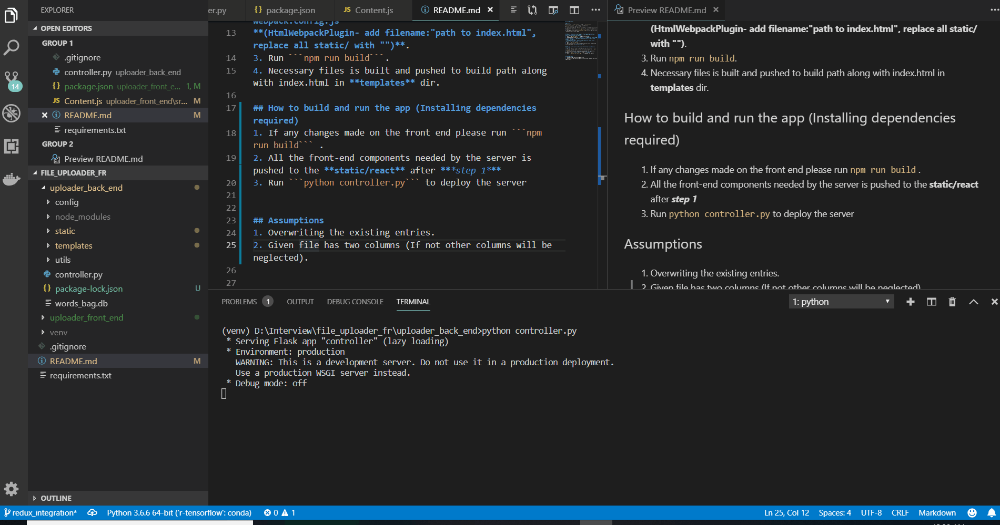

# File Uploader



### Note:
Please run ``` npm install``` and ```pip install requirements.txt``` to install dependencies.
Project comprises of two parts: 
1. uploader_back_end  [flask app](https://github.com/pallets/flask).
2. uploader_front_end [Create React App](https://github.com/facebook/create-react-app) .


## How to integrate react app to flask app (Optional as build path has been already set)
1. Run ```npm run eject``` to generate config.
2. Replace/Add values in **path.js** (**appBuild: resolveApp('build-path ex: ../uploader_back_end/static/react') and webpack.config.js**
**(HtmlWebpackPlugin- add filename:"path to index.html", replace all static/ with "")**.
3. Run ```npm run build```.
4. Necessary files is built and pushed to build path along with index.html in **templates** dir.

## How to build and run the app (Installing dependencies required)
1. If any changes made on the front end please run ```npm run build``` .
2. All the front-end components needed by the server is pushed to the **static/react** after ***step 1***
3. Run ```python controller.py``` to deploy the server


## Assumptions
1. Overwriting the existing entries.
2. Given file has two columns (If not other columns will be neglected).


